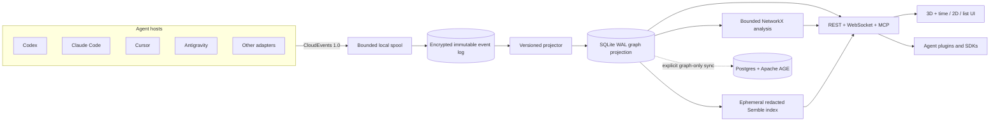

# Architecture

## System boundary

Brain Hub is one local authority with many thin capture adapters. Native hooks and telemetry provide passive registration; MCP provides deliberate read/write operations. Neither is treated as a complete replacement for the other.

## Write path

1. An adapter emits a CloudEvents 1.0 envelope with a deterministic event ID.
2. A nonblocking spool acknowledges the host before network I/O and retries with bounded backoff.
3. The local service authenticates the caller, validates size/content policy, redacts disallowed fields, encrypts content-bearing values, and appends the event in a SQLite transaction.
4. A versioned projector creates or supersedes nodes and edges. Projector progress is checkpointed in the same transaction as projection writes.
5. Search snapshots and connected clients receive an invalidation/version signal. Derived state can always be rebuilt from the event log.

At-least-once delivery is intentional. `event.id` is the idempotency key; accepting the same ID with different canonical content is an integrity error.

## Read path

Search is a fusion of lexical/semantic relevance and graph context. Semble receives only a redacted document projection in a temporary directory; Brain Hub does not call Semble's persistence API. The service atomically swaps a completed in-memory index into use. If semantic indexing is unavailable, responses explicitly mark `search_mode=lexical_degraded`.

An anchored query starts with a selected node, filters candidates to its bounded neighborhood, and ranks only that set. The default depth is two hops; users may explicitly expand it up to 20 hops. Scene node and edge budgets still apply. There is no silent global fallback; the client must ask for one.

NetworkX is used for bounded subgraphs, shortest evidence paths, communities, and offline analysis. It is never serialized as the primary database and never drives browser layout directly.

## Temporal model

Every assertion has two clocks:

- `valid_time`: when the fact applied in the represented world;
- `recorded_time`: when Brain Hub learned or changed the assertion.

The UI's fourth dimension is time. A scrubber selects a valid-time window while a separate control can expose the history of recorded corrections. Old assertions are retained; `SUPERSEDES` and `CONTRADICTS` make revision visible.

## Identity and merging

Nodes may merge automatically only when a stable external identifier or canonical content hash is equal. Embedding or lexical similarity creates a `merge_suggestion` review item. This avoids turning two related ideas into one fact without consent.

## Graphify boundary

Graphify is an importer/exporter, not the canonical store. The integration invokes its public CLI/JSON surface and records the Graphify version and source hashes. Binary relations become normal typed edges. Hyperedges become reified nodes connected with `PARTICIPATES_IN`, preserving meaning that a pairwise projection would lose.

## Local and cloud editions

Local SQLite is the source of truth for a solo installation. Optional cloud synchronization operates on a filtered graph-fact journal with independent idempotency and cursor checkpoints. The cloud schema uses relational audit tables and Apache AGE for graph queries; it never receives raw content unless a future, separately consented feature is introduced.

The sync boundary is deliberately narrow so users can disable or self-host it without losing the core product.
